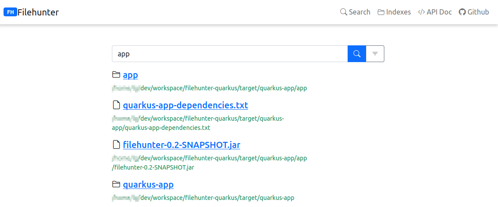

# filehunter 

Simple, fast, open source file search engine. Designed to be local file search engine for places where multiple documents 
are stored on multiple hosts with multiple directories.

## Get started
1. Download the latest version from releases in Github
2. Create separate directory where you put binary file
3. `chmod +x ./filehunter` and run it `./filehunter`
4. Open in browser `http://<HOST_IP>:8034`
5. Create new index with name and directory

## Screenshot

## Configuration variables
Filehunter might be configured using env variables. Lists of variables is available below. 
You can set this value `./filehunter -Dvar.name=var.value -Dvar2.name=var2.value` for example `./filehunter -Dfilehunter.storage.directory=/tmp/myindexdirectory`

| var | description | default value|
|-----|-------------|---------------|
| filehunter.storage.directory | Directory for index data | `./filehunterstorage` |

## FAQ
- Is Filehunter ready and steady?
  - Nope, right now is in early development stage and probably has some bugs which might make it hard to use
- I found a bug, where I can report it?
  - The easiest way is to open issue using Github
- I've added a new index but when I try to search for something I got empty results, what is wrong?
  - Is this directory was indexed? Filehunter needs a few seconds or minutes or hours (depends on how many files are in the directory) after the index was created to be able to search for something. Check the date in indexes when directory reindex was finished.
- How long may take to reindex whole directory?
  - It depends on how fast is access to your storage. For example, NMVe drive and directory with 120k files with size of 5GB first reindex take about 30 seconds. 800k files with size of 1 TB over NAS storage take 30 minutes for first reindex
- How to change host and/or port?
  - Run with parameters `./filehunter -Dquarkus.http.port=8888 -Dquarkus.http.host=127.0.0.1` You can change all parameters from [this list](https://quarkus.io/guides/all-config)
- Files in my directory changed frequently, when new files will be available to search?
  - It depends on index configuration. Check option `File structure interval` in index configuration

### Roadmap
- move configuration to separate file
- more configuration options:
  - enable/disable UI
  - enable/disable methods in API 
- ~~improve search relevance~~ DONE
- ~~improve advanced search in UI~~ DONE
- ~~metadata extraction using Apache Tika~~ DONE
- support for different architectures like Windows ~~or ARM~~ DONE
